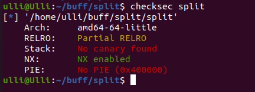

## ROP

First thing we do is to check the file with checksec.

We have no canary found which means we can overwrite the registers and NX is enabled which means we cannot write shellcode and execute it.

```bash
ulli@Ulli:~/buff/split$ file split
split: ELF 64-bit LSB executable, x86-64, version 1 (SYSV), dynamically linked, interpreter /lib64/ld-linux-x86-64.so.2, for GNU/Linux 3.2.0, BuildID
```

After that we can start to find

